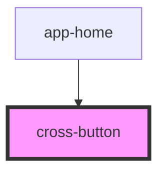

# tail-button

<!-- Auto Generated Below -->

## Properties

| Property    | Attribute    | Description | Type      | Default    |
| ----------- | ------------ | ----------- | --------- | ---------- |
| `circle`    | `circle`     |             | `boolean` | `false`    |
| `color`     | `color`      |             | `string`  | `'blue'`   |
| `disabled`  | `disabled`   |             | `boolean` | `false`    |
| `fullWidth` | `full-width` |             | `boolean` | `false`    |
| `pill`      | `pill`       |             | `boolean` | `false`    |
| `selected`  | `selected`   |             | `boolean` | `false`    |
| `size`      | `size`       |             | `string`  | `'medium'` |
| `square`    | `square`     |             | `boolean` | `false`    |
| `type`      | `type`       |             | `string`  | `'button'` |
| `ui`        | `ui`         |             | `string`  | `'simple'` |

## Dependencies

### Used by

 - [app-home](../../../dev/components/home)

### Graph

----------------------------------------------

*Built with [StencilJS](https://stenciljs.com/)*
